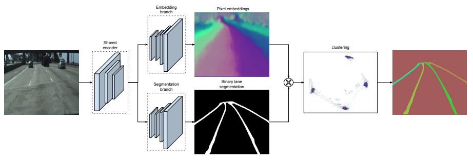

<h1 align="center">
Lane Detection using PyTorch
</h2>
<p align="center">

## Overview
This repository contains code written explicitly in [**Python 3**](https://www.python.org/) for lane detection. Moreover, [**PyTorch**](https://pytorch.org) framework is used to implement the LaneNet introduced in [Towards End-to-End Lane Detection: an Instance Segmentation Approach](https://arxiv.org/pdf/1802.05591.pdf). In this paper, authors propose to cast the lane detection problem as an end-to-end instance segmentation problem, in which each lane forms its own instance.

## Few words about the idea


**System Overview**
{:height="80px" width="80px"}

**LaneNet Architecture**


___
## Table of Contents

- [Requirement](#Requirement)
- [Download and prepare the dataset](#Download-and-prepare-the-dataset)
- [Training the E-Net base LaneNet](#Training-the-E-Net-base-LaneNet)
- [Do evaluation on the test dataset](#Do-evaluation-on-the-test-dataset)
- [Generate some GIF to show the result](#Generate-some-GIF-to-show-the-result)
- [Reference](#Reference)
___
## Requirement
* Python 3.7
* [PyTorch 1.4.0](https://pytorch.org)
* [torchvision](https://pytorch.org/docs/stable/torchvision/index.html#torchvision)
* [sklearn 0.22.1](https://scikit-learn.org/stable/)
* [NumPy 1.18.2](https://numpy.org)

___
## Download TUSIMPLE dataset

Firstly, we have to download the Lane Detection Challenge dataset from [TUSIMPLE](https://github.com/TuSimple/tusimple-benchmark/issues/3) GitHub repository.

Moreover:

1. Download [**train_set.zip**](https://s3.us-east-2.amazonaws.com/benchmark-frontend/datasets/1/train_set.zip) and unzip it to folder ``Lane_Detection_PyTorch/TUSIMPLE``
2. Download [**test_set.zip**](https://s3.us-east-2.amazonaws.com/benchmark-frontend/datasets/1/test_set.zip) and unzip it to folder ``Lane_Detection_PyTorch/TUSIMPLE`` 
3. Download [**test_label.json**](https://s3.us-east-2.amazonaws.com/benchmark-frontend/truth/1/test_label.json) and put it into the folder ``Lane_Detection_PyTorch/TUSIMPLE/test_set`` which is unzipped from ``test_set.zip``

## Prepare TUSIMPLE dataset

After you download the dataset from TUSIMPLE GitHub repository, some preprocess is needed to prepare the dataset for training and testing.

1. Process the ``train_set`` split into ground truth image, binary ground truth and instance ground truth, you should run

```
python utils/process_train_set.py --src_dir (your train_set folder place)
for me this step is: python utils/process_training_dataset_2.py --src_dir /Users/smiffy/Documents/GitHub/ECBM6040-Project/TUSIMPLE/train_set
```

2. Then you can delete the folder ``ECBM6040-Project/TUSIMPLE/train_set`` and json files in ``ECBM6040-Project/TUSIMPLE/training``

3. You should see some folder like that in your ``train_set``
```
ECBM6040-Project
|---TUSIMPLE
.   |---Lanenet_output
.   |   |--lanenet_epoch_39_batch_8.model
.   |
.   |---training
.   |   |--lgt_binary_image
.   |   |--gt_image
.   |   |--gt_instance_image
.   |
.   |---txt_for_local
.   |   |--test.txt
.   |   |--train.txt
.   |   |--val.txt
.   |
.   |---test_set
.   |   |--clips
.   |   |--test_tasks_0627.json
.   |   |--test_label.json
.   |   |--readme.md
.   |
.   |---test_clips
```

***For the data prepare you can reference [LaneNet TensorFlow project](https://github.com/MaybeShewill-CV/lanenet-lane-detection) but there is some different.***
___
## Training the E-Net base LaneNet
1. Dataset for training: You can use ``ECBM6040-Project/Notebook-experiment/Dataset Show.ipynb`` to see the dataset for training
2. Use the ``ECBM6040-Project/Train.ipynb`` to train the LaneNet, the model will save in ``ECBM6040-Project/TUSIMPLE/Lanenet_output``
3. You can also train the LaneNet with augmented dataset by using ``ECBM6040-Project/Train_aug.ipynb``
___
## Do evaluation on the test dataset
The evaluation base on TuSimple challenge evaluation method you can get more information from [TuSimple exampe](https://github.com/TuSimple/tusimple-benchmark/blob/master/example/lane_demo.ipynb)
1. You can use the jupyter notebook ``ECBM6040-Project/Notebook-experiment/Evaluation of Lanenet.ipynb`` to see the evaluation result
2. The final evaluation result is like that:

|               | Accuracy |    FP   |    FN   |
|:--------------|:---------|:--------|:--------|
| Original Paper| 96.4%    | 7.80%   |  2.44%  |  
| My result     | 94.3%    | 14.70%  |  6.95%  |
| My result aug | 94.7%    | 15.08%  |  6.24%  |
3. The speed result is like that:

**Original Paper** : fps is 62.5 ``(one NVIDIA 1080 TI)``

|               | time (ms)|
|:--------------|:---------|
| Forward pass  | 12       |
| Clustering    | 4.6      |

**My Result** : fps is 20(forward), 1.6(clustering) ``(Google Cloud Platform and one  NVIDIA Tesla P100 GPU and clustering use CPU)``

|               | time (ms)|
|:--------------|:---------|
| Forward pass  | 50       |
| Clustering    | 619      |

___
## Generate some GIF to show the result

Use the ``ECBM6040-Project/Notebook-experiment/Generate Video and show the result.ipynb``, you can generate some gif to show the result on some clips in ``ECBM6040-Project/TUSIMPLE/test_clips`` and output gif will find in ``ECBM6040-Project/TUSIMPLE/gif_output``


___
## Reference
[1] Neven, D., De Brabandere, B., Georgoulis, S., Proesmans, M. and Van Gool, L., 2018, June. Towards end-to-end lane 
detection: an instance segmentation approach. In 2018 IEEE intelligent vehicles symposium (IV) (pp. 286-291). IEEE. 
https://arxiv.org/abs/1802.05591

[2] LaneNet TensorFlow project https://github.com/MaybeShewill-CV/lanenet-lane-detection

[3] TuSimple Dataset https://github.com/TuSimple/tusimple-benchmark

[4] E-Net Project https://github.com/davidtvs/PyTorch-ENet
